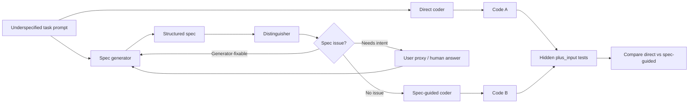
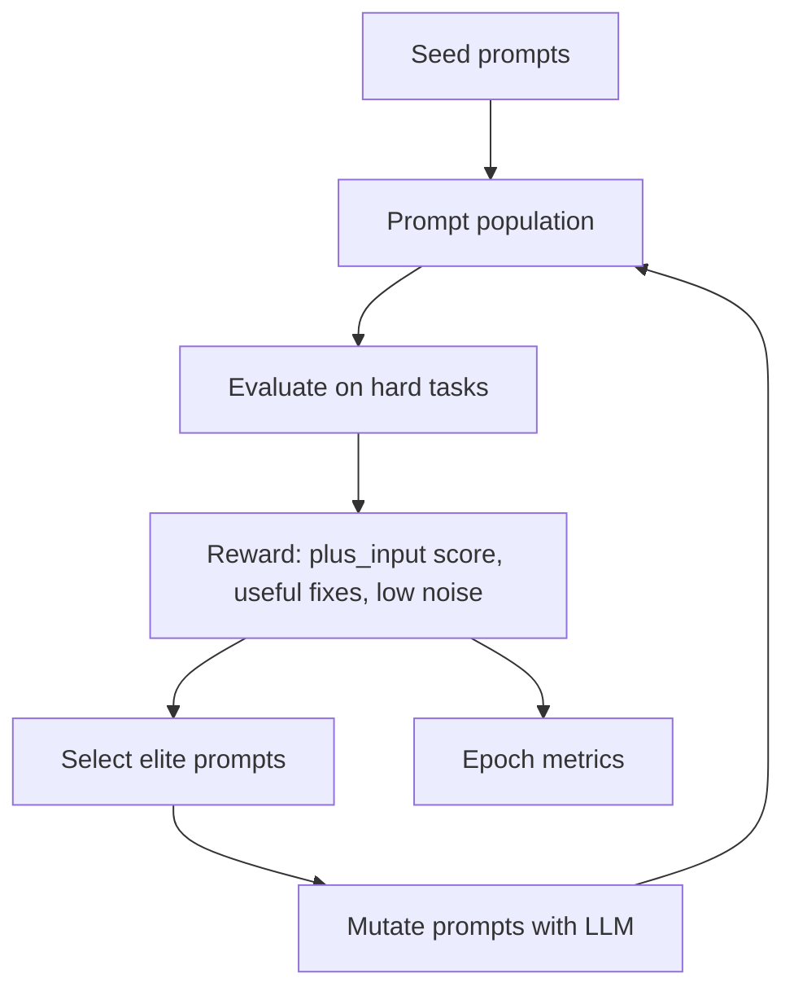

# IDCS: Coevolving Specifications for Safer Program Synthesis

**Authors:** Amit Saroussi; Amir Sarid; Nitzan Pomerantz; Uri Ariel
**Author order and affiliations:** to be confirmed before final submission
**With:** Apart Research
**Event:** The Secure Program Synthesis Hackathon, May 22-24, 2026
**Repository:** https://github.com/aimir/idcs

## Abstract

AI coding systems often fail for a simple reason: the user request is not a full specification. The code can be syntactically correct and still be wrong about edge behavior, security assumptions, or domain policy. IDCS studies whether a spec-guided coding pipeline can outperform direct code generation on underspecified program synthesis tasks.

Our prototype separates the workflow into four roles: a generator drafts a structured specification from the user request, a distinguisher critiques missing or ambiguous behavior, a user proxy answers clarification questions when needed, and a coder writes the final implementation from the refined spec. We evaluate the pipeline against direct code generation on MBPP+ tasks selected for hidden edge semantics rather than algorithmic difficulty.

On an initial five-task hard MBPP+ `plus_input` slice, direct Codex-mini generation failed perfect hidden-edge scoring on all 5 tasks. The generated-spec pipeline rescued 1 of the 5 tasks with no regressions, improving aggregate `plus_input` pass rate from 110/531 tests, or 20.7%, to 179/531 tests, or 33.7%. A separate hardened proof-of-concept dataset showed that oracle specifications can solve cases that direct generation misses, but generated specifications still need improvement.

The main takeaway is modest but useful: hidden-edge benchmarks reveal real headroom for specification-guided coding, and the next bottleneck is not code generation itself but automatically evolving prompts that elicit and validate the right specification.

## 1. Introduction

Large language models can now write plausible code from short prompts. That makes programming faster, but it also makes a familiar software problem sharper: the prompt often does not say enough. A request like "remove uppercase characters", "find the kth element", or "apply a coupon" may sound clear to a human, but the exact behavior depends on edge semantics: punctuation, empty inputs, duplicate values, rounding, tie-breaking, or policy defaults.

For secure program synthesis, this matters because a verifier or test suite can only check the property it is given. If the specification is wrong or underspecified, stronger implementation machinery may simply produce a more confidently wrong program. This matches the framing from the hackathon resources: the hard part is often specifying the right thing, not merely generating code that matches a written artifact.

IDCS asks a practical question:

> Can a pipeline that first writes and critiques a specification produce safer or more correct code than direct code generation from the original prompt?

We focus on small Python programming tasks because they are easy to run repeatedly and score objectively. The long-term target is broader: security-relevant synthesis where missing intent causes vulnerabilities. In this hackathon prototype, we use MBPP+ `plus_input` tests and a small hardened benchmark to expose cases where direct generation passes obvious examples but fails hidden edge behavior.

Our main contributions are:

1. A runnable spec-guided program synthesis pipeline with separate generator, distinguisher, user-proxy, coder, scoring, and telemetry components.
2. A hard MBPP+ benchmark slice selected for underspecified edge semantics rather than algorithmic difficulty.
3. Initial evidence that generated specifications can rescue failures that direct generation misses, plus a coevolution setup intended to improve prompts over training epochs.

## 2. Related Work

The Apart Secure Program Synthesis Hackathon frames the challenge as building tools to make AI-written code verifiable and trustworthy, with tracks covering specification elicitation, specification validation, spec-driven development, and adversarial robustness for proof tools. IDCS sits mainly between specification elicitation, specification validation, and spec-driven development.

The hackathon resource "Tractable Problems in AI Security via Formal Methods" argues that proofs are getting cheaper while specifications remain expensive. It distinguishes between verifying that code matches a spec and validating that the spec is what the user actually meant. IDCS targets this left-side gap: it tries to make missing intent visible before code is generated.

Galois' "Specifications Don't Exist" motivates a similar stance: specifications are not simply discovered as complete artifacts. They are negotiated, refined, and validated against the real system and stakeholders. Our prototype treats a spec as an evolving artifact rather than a static prompt expansion.

EvalPlus and MBPP+ provide a practical evaluation surface. MBPP tasks often contain a short natural-language prompt and a few visible tests. MBPP+ adds many additional edge-case tests, which makes it useful for detecting when a model wrote code that matched the easy examples but missed exact semantics.

Prior secure program synthesis and formal methods work often assumes a strong specification is already available. IDCS instead asks whether an LLM-mediated pipeline can improve the specification itself before asking the model to implement code.

## 3. Methods

### 3.1 Pipeline

IDCS compares two paths on the same task.

The direct path gives the task prompt directly to a coder model and scores the generated Python function.

The spec-guided path first asks a generator model to produce a structured specification. A distinguisher then searches for ambiguity, underconstraint, overconstraint, and missing edge cases. When an issue requires user intent, a user-proxy can answer. Otherwise the generator revises the spec. After a bounded number of turns, the coder receives both the original prompt and the final structured spec.



**Figure 1.** IDCS compares direct code generation with a spec-guided loop. The core bet is that some code failures are really specification failures.

### 3.2 Benchmark Selection

The first seed tasks were too easy: both direct and spec-guided generation solved nearly everything. We therefore added a named hard MBPP+ slice focused on tasks that look simple but contain hidden edge semantics. We intentionally avoided selecting tasks just because they require hard algorithms.

The current MBPP+ hard slice contains:

- `Mbpp/427` - `change_date_format`
- `Mbpp/639` - `sample_nam`
- `Mbpp/459` - `remove_uppercase`
- `Mbpp/92` - `is_undulating`
- `Mbpp/597` - `find_kth`

These tasks are useful because direct solutions often pass visible examples and base tests but fail `plus_input` behavior. For example, `remove_uppercase` forces a decision about whether to keep all non-uppercase characters or only lowercase characters. `find_kth` forces exact indexing and behavior when one input array is empty. `sample_nam` forces the distinction between "not lowercase first character" and stricter title-case semantics.

### 3.3 Scoring

For MBPP+ tasks, each candidate implementation is executed against both base tests and `plus_input` tests. The main metric is `plus_input` pass rate, because those tests better expose hidden edge behavior.

We report:

- direct pass rate
- spec-guided pass rate
- tasks where direct failed perfect scoring
- tasks rescued by spec-guided generation
- regressions, where direct passed but spec-guided failed
- aggregate passed hidden tests across all selected tasks

### 3.4 Prompt Coevolution

The project is not meant to start with a hand-written perfect prompt. The intended method is to coevolve the generator and distinguisher prompts.

At a high level:

1. Start from seed generator and distinguisher prompts.
2. Keep a small population of prompt variants.
3. Evaluate each prompt pair on sampled benchmark tasks.
4. Reward prompt pairs that improve hidden-test behavior while penalizing unhelpful clarification loops and excessive complexity.
5. Keep the best prompt variants and mutate them for the next epoch.



**Figure 2.** Coevolution loop. The goal is to optimize the prompts that produce and critique specifications, not to manually bake in the final best prompt.

We ran a local Codex-mini coevolution smoke test from clean seed prompts with:

- benchmark: hard MBPP+ slice
- epochs: 3
- population size: 3
- elite size: 1
- max turns: 2
- task sample size: 2
- seed: 42
- model: `gpt-5.4-mini`

This is intentionally a small run for iteration speed. It is not a final
statistical result, but it verifies that prompt populations, selection,
mutation, and epoch telemetry work end to end on the hard benchmark.

## 4. Results

### 4.1 MBPP+ Hard Slice

The strongest verified result so far is the Codex-mini run on the five-task hard MBPP+ slice. Each task passed the original/base tests in both direct and spec-guided paths, but the hidden `plus_input` tests exposed failures.

**Table 1. Verified hard MBPP+ `plus_input` results.**

| Task | Function | Direct plus pass rate | Spec-guided plus pass rate | Result |
| --- | --- | ---: | ---: | --- |
| `Mbpp/427` | `change_date_format` | 12/112 = 10.7% | 12/112 = 10.7% | no change |
| `Mbpp/639` | `sample_nam` | 2/111 = 1.8% | 2/111 = 1.8% | no change |
| `Mbpp/459` | `remove_uppercase` | 25/103 = 24.3% | 25/103 = 24.3% | no change |
| `Mbpp/92` | `is_undulating` | 32/101 = 31.7% | 101/101 = 100.0% | rescued |
| `Mbpp/597` | `find_kth` | 39/104 = 37.5% | 39/104 = 37.5% | no change |
| **Total** | 5 tasks | **110/531 = 20.7%** | **179/531 = 33.7%** | **1 rescue, 0 regressions** |

The task-level summary:

- direct generation failed perfect `plus_input` scoring on 5/5 tasks
- spec-guided generation failed perfect `plus_input` scoring on 4/5 tasks
- spec-guided generation rescued 1/5 tasks
- no task regressed from direct success to spec-guided failure

This is not enough data for a strong statistical claim. It is enough to show that the benchmark is no longer saturated and that the spec-guided path has measurable room to improve.

### 4.2 Hardened Gold-Spec POC

A separate hardened proof-of-concept dataset tests an even clearer question: if the missing semantics are supplied in a gold specification, can the same model solve tasks that direct generation misses?

The first Codex-backed run on the hardened POC reported:

**Table 2. Hardened POC signal.**

| Metric | Result |
| --- | ---: |
| Tasks | 5 |
| Direct failed | 4/5 |
| Generated-spec failed | 5/5 |
| Gold-spec failed | 0/5 |
| Gold-spec rescues | 4/5 |
| Generated-spec rescues | 0/5 |

This result is important because it separates two questions:

1. Do specifications matter? Yes, the gold specifications solved cases direct generation missed.
2. Does the current generated-spec loop already recover those specifications? Not yet on this hardened POC.

That makes the next research target clear: improve spec generation and discrimination until generated specs move closer to gold specs.

### 4.3 Diagnostic Manual Optimization

A scratch manual prompt-optimization probe later reached 3/5 rescues and an aggregate spec-guided score of 244/531 = 45.9% on the hard MBPP+ slice.

We do not treat this as the core method or final result. It is diagnostic evidence that better prompt instructions can improve the pipeline. The intended result should come from coevolution starting from seed prompts, not from manually selecting benchmark-specific wording.

This diagnostic result is included only as a sanity check that prompt wording
matters. It should not be used as the main performance claim.

### 4.4 Coevolution Results

The first local Codex-mini coevolution smoke test used the hard MBPP+ slice,
three epochs, population size 3, elite size 1, max turns 2, and two sampled
tasks per role evaluation. The run started from the seed prompts rather than
the manual diagnostic prompt.

**Table 3. Codex-mini coevolution smoke from seed prompts.**

| Epoch | Best generator reward | Avg generator reward | Best distinguisher reward | Avg distinguisher reward | Notes |
| ---: | ---: | ---: | ---: | ---: | --- |
| 1 | 0.130 | 0.064 | 0.763 | 0.615 | D found variants that preserve the `Mbpp/92` rescue. |
| 2 | 0.097 | 0.021 | 0.771 | 0.705 | D improved slightly; G regressed on this sampled task pair. |
| 3 | 0.175 | 0.142 | 0.280 | 0.214 | G recovered; D dropped on a different sampled pair (`Mbpp/639`, `Mbpp/459`). |

The result is noisy because the run samples only two tasks per role evaluation.
The useful signal is operational: the coevolution machinery runs from seed
prompts, records prompt populations and per-epoch metrics, and can surface
better critic prompts. The next experiment should use a larger task sample and
a stronger model to reduce sampling noise.

We then ran a second local Codex experiment with `gpt-5.4`, two epochs, the
same population size, and three sampled tasks per role evaluation. This run
also started from seed prompts and saved the best prompt text per epoch.

**Table 4. Codex `gpt-5.4` coevolution smoke from seed prompts.**

| Epoch | Best generator reward | Avg generator reward | Best distinguisher reward | Avg distinguisher reward | Notes |
| ---: | ---: | ---: | ---: | ---: | --- |
| 1 | 0.056 | 0.023 | 0.403 | 0.326 | Harder three-task sample; D receives positive reward for surfacing issues. |
| 2 | 0.170 | 0.126 | 0.322 | 0.107 | G reward improves on the sampled set, but D reward drops on a different sample. |

We validated the saved epoch-2 prompts on the full five-task hard slice. This
did **not** improve hidden-test pass rate over the seed prompts:

| Prompt set | Full-slice plus pass rate | Perfect tasks |
| --- | ---: | ---: |
| Seed prompts | 110/531 = 20.7% | 0/5 |
| Epoch-2 coevolved prompts | 110/531 = 20.7% | 0/5 |

This is a useful negative result. The optimizer can run, mutate prompts, select
different candidates, and surface stronger critics on sampled tasks, but the
current small run does not yet produce a prompt pair that generalizes across
the full hard slice.

## 5. Discussion and Limitations

The main result is directional. IDCS does not yet prove that spec-guided coding broadly beats direct coding. It shows something narrower and useful:

- easy benchmarks can hide the value of specification work
- MBPP+ `plus_input` cases expose real direct-generation failures
- a generated spec loop can rescue at least some of those failures
- oracle/gold specs can solve more failures, so the remaining bottleneck is specification generation and validation

The project also gives a practical evaluation pattern for future work. A good task for IDCS is not necessarily a hard algorithm. It is a simple-looking task where exact behavior matters and the original prompt does not fully specify that behavior.

### Limitations

The current hard MBPP+ slice has only five tasks. This is useful for fast iteration, but too small for a final benchmark claim.

The benchmark is still Python-only and unit-test-based. It does not yet cover memory safety, concurrency, system calls, network security, proof assistants, or larger real-world software patches.

The user-proxy component is currently a simplification. In real specification elicitation, a human stakeholder may answer inconsistently, reject a proposed interpretation, or reveal new constraints late in the process.

The current generated-spec loop still fails on most hard tasks. The result should not be read as "IDCS solved specification elicitation." It should be read as "we found a benchmark where specifications matter, and the pipeline already has a measurable but incomplete advantage."

OpenRouter-based Haiku runs were blocked locally by insufficient credits on the provided key. The current coevolution smoke uses the local Codex backend instead. A larger local Codex model produced sampled reward movement, but full-slice validation of the saved prompt pair did not beat the seed prompts.

### Future Work

The immediate next step is to rerun coevolution with full-slice or larger-sample evaluation in the selection loop, then evaluate the best evolved generator/distinguisher prompts on held-out tasks. The current sampled loop is too noisy to treat sampled reward as final benchmark improvement.

After that, we should expand the hard benchmark slice from 5 tasks to 20-30 tasks, still selecting for underspecified semantics rather than algorithmic difficulty.

We should add better spec diagnostics: underconstraint rate, overconstraint rate, clarification usefulness, and agreement with gold specs where available.

Finally, we should move toward security-shaped tasks: access-control decisions, input validation, path traversal, token redaction, sandbox policy, and authorization edge cases. These tasks better match the secure program synthesis motivation than generic coding puzzles.

## 6. Conclusion

IDCS is a prototype for testing whether specification work can make AI-written code safer and more correct. The early evidence says yes in a limited but meaningful sense: on a hard MBPP+ slice selected for hidden edge semantics, direct generation failed all five tasks on perfect `plus_input` scoring, while the spec-guided path rescued one task and improved aggregate hidden-test pass rate from 20.7% to 33.7% without regressions.

The stronger lesson is about evaluation. If the benchmark is too easy, direct code generation looks solved and the value of specs disappears. Once the benchmark contains realistic underspecification, there is measurable headroom. The next step is to coevolve the generator and distinguisher prompts so that the system learns to discover those missing semantics automatically.

## Code and Data

- **Code repository:** https://github.com/aimir/idcs
- **Main PR stack:** PR #10 (Phase 3 coevolution base), PR #11 (Codex backend and batch runner), PR #12 (hard MBPP+ benchmark slice), PR #13 (hardened gold-spec POC), PR #14 (coevolution observability and report)
- **Datasets:** MBPP+ via EvalPlus; local `hard` slice over selected MBPP+ task IDs; separate local `hardened` POC dataset
- **Verified run artifact:** `/private/tmp/idcs-hard-batch-current-mt3/summary.json` and `/private/tmp/idcs-hard-batch-current-mt3/results.jsonl`
- **Coevolution run artifacts:** `/private/tmp/idcs-coevolve-seed/experiments/runs/20260524T170607Z/` and `/private/tmp/idcs-coevolve-seed/experiments/runs/20260524T175202Z/`

## Author Contributions

Author order and exact affiliations should be confirmed by the team before
submission. Draft contribution wording: Amit Saroussi led benchmark integration,
evaluation runs, and report assembly. Amir Sarid led Phase 3 coevolution
experiments and project direction. Nitzan Pomerantz contributed review feedback,
issue framing, and benchmark-debugging guidance. Uri Ariel contributed issue
taxonomy and vulnerability benchmark work. All authors contributed to
experiments, interpretation, and writing.

## References

1. Apart Research. 2026. "The Secure Program Synthesis Hackathon." https://apartresearch.com/sprints/secure-program-synthesis-hackathon-2026-05-22-to-2026-05-24
2. Quinn Dougherty / Forall R&D. 2026. "Tractable Problems in AI Security via Formal Methods." https://tractable.for-all.dev/apart-hackathon.pdf
3. Galois. "Specifications Don't Exist." https://www.galois.com/articles/specifications-dont-exist
4. LessWrong. "Secure Program Synthesis" sequence. https://www.lesswrong.com/s/uuY62aBQw8j3ASaCS
5. for-all-dev. "awesome-secure-program-synthesis." https://github.com/for-all-dev/awesome-secure-program-synthesis
6. EvalPlus. "Rigorous Evaluation of LLM-Synthesized Code." https://github.com/evalplus/evalplus
7. EvalPlus Team. "EvalPlus benchmark site and leaderboard." https://evalplus.github.io/
8. Kiniry, Joe. 2026. Secure program synthesis hackathon slides. Local slide deck shared with participants.

## Appendix

### A. Task Selection Rationale

The hard MBPP+ slice was chosen to test underspecified semantics:

- `Mbpp/427` asks for date-format conversion. The hidden behavior turns on text rewriting versus calendar validation.
- `Mbpp/639` asks for summing selected names. The hidden behavior turns on exact casing semantics.
- `Mbpp/459` asks to remove uppercase characters. The hidden behavior turns on whether punctuation and digits are retained.
- `Mbpp/92` asks for an undulating sequence predicate. The hidden behavior turns on exact necessary and sufficient conditions.
- `Mbpp/597` asks for the kth element from sorted arrays. The hidden behavior turns on one-indexing, empty sides, and sorting the merged sequence.

### B. Reproduction Commands

```bash
IDCS_BACKEND=codex \
IDCS_CODEX_MODEL=gpt-5.4-mini \
IDCS_CODEX_TIMEOUT_S=180 \
uv run --no-project --with '.[dev]' python scripts/batch_baseline.py \
  --dataset hard \
  --workers 2 \
  --retries 0 \
  --max-turns 3
```

Codex-mini coevolution command from clean seed prompts:

```bash
IDCS_BACKEND=codex \
IDCS_CODEX_MODEL=gpt-5.4-mini \
IDCS_CODEX_TIMEOUT_S=180 \
uv run --no-project --with '.[dev]' python scripts/train.py \
  --benchmark hard \
  --epochs 3 \
  --pop-size 3 \
  --elite-size 1 \
  --max-turns 2 \
  --task-sample 2 \
  --seed 42 \
  --max-llm-calls 220
```

Stronger local Codex smoke with saved prompt candidates:

```bash
IDCS_BACKEND=codex \
IDCS_CODEX_MODEL=gpt-5.4 \
IDCS_CODEX_TIMEOUT_S=240 \
uv run --no-project --with '.[dev]' python scripts/train.py \
  --benchmark hard \
  --epochs 2 \
  --pop-size 3 \
  --elite-size 1 \
  --max-turns 2 \
  --task-sample 3 \
  --seed 42 \
  --max-llm-calls 240
```

### C. What Would Count as Stronger Evidence?

A stronger final result would show:

1. more than five benchmark tasks
2. larger-sample coevolution improvement from seed prompts
3. a held-out validation split not used for prompt evolution
4. fewer generated-spec failures on the hardened gold-spec POC
5. examples where the generated spec identifies the exact missing edge semantics

## LLM Usage Statement

LLM assistance was used to draft report text, inspect code and run artifacts, generate and mutate prompts, and run code-generation experiments. The benchmark claims reported here were checked against local run artifacts; the final submitted version should still be reviewed by the project authors, especially for author order and affiliations.
