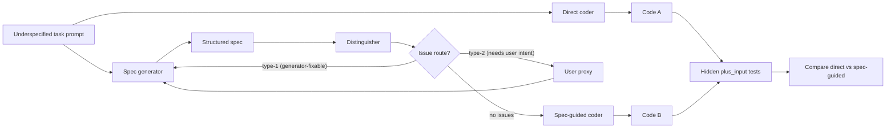

# Adversarial Iteration for Underspecified Program Synthesis

**Authors:** Uri Ariel Chen; Nitzan Pomerantz; Amir Sarid; Amit Saroussi
**With:** Apart Research

## Abstract

LLM-generated code routinely passes the obvious examples and silently fails the hidden ones. We argue that this does not represent a failure at the model level, but an underspecification of requirements. To that end, we introduce IDCS (Iterative Distinguishing of Code and Specs), a spec-guided pipeline that outperforms direct code generation on underspecified program-synthesis tasks. This pipeline, composed of a generator, a distinguisher, a user-proxy, and finally a coder, gets significantly better results than either using the coder directly or using the spec generator and coder alone, especially on prompts that are underspecified, unclear, or shorter than the behavior they imply. We also show that the generator and distinguisher prompts themselves can be generated through adversarial coevolution. We evaluate on three MBPP+ slices selected for hidden-edge semantics rather than algorithmic difficulty: an original five-task hard slice, a held-out hard-test split, and a nine-task fresh-failures slice. The hand-written spec-guided pipeline increases hidden-test pass rate from 73.3% to 96.2% on held-out test data. Coevolution from seed prompts produces transferable rescues on training tasks, but on the held-out hard-test, our best hand-crafted prompts currently beat the coevolved variants.

## 1. Introduction

LLMs now generate plausible code from short prompts, which makes it easy to forget how much intent is missing from a short prompt. For secure program synthesis the gap is sharp: a verifier or test suite can only check the property it was given, so if the specification is wrong, more confident code-generation machinery merely produces a more confidently-wrong program. In short, proofs are getting cheaper while specifications remain expensive [1], and specifications are rarely discovered as complete artifacts but rather negotiated, refined, and validated against stakeholders [2].

We treat the workflow as four cooperating LLM roles: a generator that drafts a structured spec from the natural-language task, a distinguisher that critiques the spec for gaps, ambiguities, contradictions, over- and under-constraints, and implicit assumptions, a user-proxy that answers when an issue is routed to the user, and a coder that implements the final spec. The spec is an intermediate artifact, not the final product: benchmark scoring still happens on the generated code, against hidden tests. This lets us ask a quantitative question — "does a spec layer raise hidden-test pass rate?" — instead of a stylistic one.

This way, we look at spec elicitation and validation as two aspects of the same problem — trying to make any missing intent visible before code is generated, through learning the prompts that elicit and critique that intent. The "GAN-shaped" critic loop also connects naturally to adversarial robustness, but in this hackathon prototype the adversary is the spec-time distinguisher, not a code-time attacker.

Every MBPP+ task has around 100 hidden `plus_input` cases that EvalPlus auto-derives by fuzzing the canonical reference solution. Our score denominators sum these cases across the slice's tasks. The hard slice doubles as the coevolution training pool, hard-test is strictly held out, and fresh-failures is a separate nine-task pool of MBPP+ problems where direct generation passes the base tests but fails on at least one `plus_input` case. We use the term "hidden semantics" for the edge behavior these cases reward that the natural-language prompt leaves underspecified.

Our main contributions are:

1. **A runnable spec-guided synthesis pipeline.** Generator, distinguisher, user-proxy, coder, scorer, and per-episode telemetry, that increases code quality according to our benchmarks (detailed below).
2. **Three benchmark slices for underspecified semantics.** An original hard slice (low partial direct, 101/531), held-out hard-test split (higher partial direct, 406/554), and a fresh-failures slice (788/994), all selected from MBPP+ `plus_input` for hidden-edge semantics. Reward function decomposes into generator and distinguisher terms with anti-regression and excess-clarification penalties. Our iterative pipeline shows pass-rate increasing from 73.3% to 96.2% on a held-out test set.
3. **A diagnostic ceiling.** A specifically crafted prompt that encodes the five hidden semantics reaches 531/531, proving the architecture itself can exploit correct specs end-to-end, so the remaining bottleneck is automatic spec discovery, not implementation.

## 2. Related Work

The two-network adversarial setup was inspired by the work of Goodfellow et al. [3]. We adopt a similar abstraction, with a generator and a critic improving against each other, but at the prompt level rather than the weight level. In our setup, both roles are LLM system prompts that we mutate and score, not parameter sets we backprop through. Population-based prompt search has recently been used for general-purpose LLM tooling [4, 5] and code agents (Saarthi-style critic loops [6]).

Galois [2] argues that "specifications don't exist" — they are constructed through dialogue and refinement, not retrieved as finished artifacts. Recent specification-elicitation work, like AlphaCodium-style spec audits [7], similarly treats spec construction as a first-class learnable step.

EvalPlus [8] and MBPP+ [9] are our scoring substrate. MBPP+ adds many `plus_input` cases per task; we score on `plus_input` because base tests rarely surface hidden-edge failures. Recent work on code-LLM evaluation, such as BigCodeBench-style hardening [10] and LiveCodeBench-style refreshes [11], reaches a similar conclusion: easy benchmarks saturate quickly and hide the specification gap.

Classical synthesis from formal specs assumes the spec is given. Recent neural-symbolic work (DreamCoder-style [12], DafnyPro [13]) blends learned components with verifiable specs. This work targets the upstream gap: where does the spec come from when the user prompt is short and vaguely worded?

## 3. Methods

### 3.1 Pipeline

IDCS compares two paths on the same task. The direct path sends the task prompt to a coder model and scores the generated function. The spec-guided path asks the generator to produce a structured spec, the distinguisher to critique it, and after a bounded number of turns the coder produces code from the user prompt and the final spec.



**Figure 1.** Pipeline structure. Issues that the generator should fix without bothering the user (type-1) loop internally, issues needing intent (type-2) escalate to the user-proxy.

### 3.2 Benchmarking and Scoring

Our seed corpora saturated quickly: both paths solved nearly everything. We therefore curated three MBPP+ slices selected for hidden-edge semantics, not algorithmic difficulty.

| Slice | Tasks | Total hidden tests | Direct pass rate (default coder) | Purpose |
| --- | --- | ---: | ---: | --- |
| `hard` / `hard-train` | `Mbpp/{639, 597, 427, 92, 459}` | 531 | 101/531 = 19.0% | Original low-direct slice. 5/5 direct task failures. |
| `hard-test` | `Mbpp/{785, 451, 757, 576, 765}` | 554 | 406/554 = 73.3% | Held-out split. Strict-hard (5/5 direct task failures) with higher partial direct. |
| `fresh-failures` | 9 base-OK / plus-fail tasks from an `mbpp-plus` sample-60 probe | 994 | 788/994 = 79.3% | Broader sanity check over freshly observed failures. |

Hard-slice picks share a pattern: the natural-language prompt is short, the hidden EvalPlus tests probe a specific edge (punctuation in `remove_uppercase`, empty halves in `find_kth`, exact casing in `sample_nam`, 1-indexed undulation in `is_undulating`, etc.). These are the cases where the spec layer has something useful to contribute.

We report direct pass rate, spec-guided pass rate, strict task-level rescues (direct failed → spec passed), strict regressions, aggregate hidden-test pass count, and benchmark delta vs direct baseline.

Per-trace reward decomposes into per-role terms with the following structure (`src/idcs/rewards.py`):

```
generator_score     = α·benchmark − β·type1_count − γ·spec_complexity_penalty − ρ·regression_penalty
distinguisher_score = α·benchmark + β·type1_fixed_count + δ·useful_clarification_rate − ε·type2_dismissed_count − cap·excess_type2_above_cap − ρ·regression_penalty
```

`regression_penalty = max(0, baseline_score − benchmark_score)` is applied to both roles when a no-spec baseline is available; it stops coevolution from trading one rescued task for broad partial regressions elsewhere (a real failure mode we observed — see the results section). `excess_type2_penalty` caps the cost of asking the user. We penalize the cap, not the average. `type1_fixed_count` uses `(kind, location)` as the issue identity so that the distinguisher cannot earn credit by rewording a stale issue.

Coevolution is GEPA-shaped [14] but lightweight: each epoch we evaluate a population of generator and distinguisher prompts on sampled tasks, score them under the reward above, and keep an elite by task-level Pareto selection so prompts that win on different tasks survive. Anchor retention keeps the original hand-written seed in the population (`keep_anchor=true` by default) to bound forgetting. A diversity guard (`SequenceMatcher ≥ 0.92`) rejects near-duplicate mutations. Mutation feedback includes per-task hidden-failure examples and peer-elite summaries so the mutator can act on the actual failure semantics, not just aggregate reward.

## 4. Results

### 4.1 Hand-written Pipeline on the Original Hard Slice

The hand-written spec-guided pipeline (default generator/distinguisher/coder, Codex `gpt-5.4-mini`) against direct generation on the original 5-task hard slice:

| Task | Function | Direct plus pass | Spec-guided plus pass | Result |
| --- | --- | ---: | ---: | --- |
| `Mbpp/427` | `change_date_format` | 12/112 | 12/112 | no change |
| `Mbpp/639` | `sample_nam` | 2/111 | 2/111 | no change |
| `Mbpp/459` | `remove_uppercase` | 25/103 | 25/103 | no change |
| `Mbpp/92`  | `is_undulating` | 23/101 | 101/101 | rescued |
| `Mbpp/597` | `find_kth` | 39/104 | 39/104 | no change |
| **Total** | 5 tasks | **101/531 = 19.0%** | **179/531 = 33.7%** | **1 rescue, 0 regressions** |

The benchmark is not saturated, and the spec-guided path has measurable headroom on hidden-edge tasks.

### 4.2 Gold-spec Hardened POC

To separate "do specs matter?" from "does our generated-spec loop already produce good enough specs?", we ran a small hardened POC where each task ships with a gold spec. With the gold spec, the same coder solves 4/5 tasks that direct generation misses. With the generated spec, it solves 0/5. That bounds the headroom: specifications matter, and our loop is not yet recovering them.

### 4.3 Held-out Hard-test Split

We held out a subset of test problems: `Mbpp/{785, 451, 757, 576, 765}`, with 554 total tests. Direct still fails all five tasks strictly (5/5 direct task failures), but partial direct pass count is much higher than the original hard slice. These are "almost right" tasks where most hidden tests pass but the edge cases fail.

The hand-written default pipeline lifts pass rate from 406/554 (direct) to 533/554 (spec-guided) — a +127 hidden-test delta, with two strict task rescues and zero regressions. The best evolved generator/distinguisher pair, selected on training reward, lifts the same slice only to 419/554 — a +13 delta. The default seed therefore beats the coevolved variants by a large margin on held-out tasks.

The pattern repeats on a broader sanity check. Over the nine-task fresh-failures slice, the default spec layer adds +75 over direct with no regressions, while semantic-prompt variants underperform. The training reward is selecting prompts that generalize worse than the hand-written seed — the standard symptom of small-sample optimization on a noisy reward, and the signal that motivates the next research directions.

### 4.4 Diagnostic Ceiling

To separate "can the architecture exploit a correct spec?" from "does our current loop produce correct specs?", we also hand-crafted a slice-specific generator/distinguisher pair that encodes the hidden EvalPlus semantics for each of the five original-hard-slice tasks directly in the prompt instructions. On the original hard slice, this pair lifts pass rate from 101/531 (19.0%) direct to 531/531 (100%) spec-guided — every test passes correctly, no regressions, a +430 hidden-test delta. This is a ceiling proof, not a generalization claim: it shows that the pipeline can demonstrably convert correct spec content into correct code end-to-end on this slice. It does not show automatic discovery of those semantics, which remains an open problem for future research.

## 5. Discussion and Limitations

A spec layer demonstrably helps on hidden-edge tasks (+127 on hard-test, +75 on fresh failures, +430 from a ceiling prompt on hard). The architecture is not the bottleneck. What we have not yet shown is that learning the right specifications, by coevolving the prompts, beats hand-written seed prompts on held-out tasks. Right now it does not.

### 5.1 Limitations

We try not to overstate our results, as they are severely limited by their sample size. First, the original hard slice has only 5 tasks, the held-out hard-test split has 5, and the fresh-failures slice has 9. None of these is enough for a strict statistical claim: they are enough to surface qualitative effects. Second, the user-proxy is a simplification of an actual human stakeholder. Indeed, real humans answer inconsistently and reveal constraints late. Third, the ceiling prompt is intentionally slice-specific and should not be cited as a general result.

### 5.2 Future Work

The immediate next step is validation-gated selection: a mutation is only promoted into the elite if it beats the anchor on a held-out task pool. Anchor retention is merely a partial mitigation; a validation gate makes the held-out comparison structural.

After that, we would:

- Expand each hard slice from 5 to ~30 tasks, still selected for underspecified semantics, to reduce sampled-reward variance.
- Revisit reward weights so quieter D wins ties with noisier D when benchmark outcome is equal.
- Move toward security-shaped tasks (access control, input validation, path traversal, redaction policy) where the missing intent has concrete safety consequences.
- Make the coder a separate optimizable prompt rather than a fixed default.
- Port the optimizer to a properly-released GEPA backend [14] to avoid hand-rolling Pareto/anchor logic.

## 6. Conclusion

We built a runnable spec-guided program-synthesis pipeline, three hidden-edge MBPP+ slices, an adversarial coevolution loop with Pareto-elite selection and anchor retention, and an anti-regression reward term. On every slice we tested, a spec layer beats direct generation on hidden-test pass rate.

The honest negative result is the most useful one for the secure-program-synthesis community: small-sample, single-pool reward optimization can select prompts that beat training tasks but lose to the hand-written seed on held-out tasks. That is the failure mode the next iteration is designed to remove.

## Code and Data

- **Code repository:** https://github.com/aimir/idcs

## References

1. Dougherty, Q., Forall R&D. 2026. *Tractable Problems in AI Security via Formal Methods.* https://tractable.for-all.dev/apart-hackathon.pdf
2. Dodds, M., Galois. 2025. *Specifications Don't Exist.* https://www.galois.com/articles/specifications-dont-exist
3. Goodfellow, I. et al. 2014. *Generative Adversarial Networks.* https://arxiv.org/abs/1406.2661
4. AlphaEvolve Team, Google DeepMind. 2025. *AlphaEvolve: A Gemini-powered coding agent for designing advanced algorithms.* https://deepmind.google/blog/alphaevolve-a-gemini-powered-coding-agent-for-designing-advanced-algorithms/
5. Large, T. G. et al. ICLR 2026. *ShinkaEvolve: Towards Open-Ended And Sample-Efficient Program Evolution.* https://arxiv.org/abs/2509.19349
6. Kumar, A. et al. 2025. *Saarthi: The first AI formal verification engineer.* https://arxiv.org/abs/2502.16662
7. Ridnik, T. et al. 2024. *Code generation with AlphaCodium: From prompt engineering to flow engineering.* https://arxiv.org/abs/2401.08500
8. Liu, J. et al. NeurIPS 2023 & COLM 2024. *EvalPlus: Rigorous Evaluation of LLM-Synthesized Code.* https://github.com/evalplus/evalplus
9. *MBPP+ (extension of MBPP with `plus_input` cases).* https://evalplus.github.io/
10. Zhuo, T. Y. et al. ICML 2025. *BigCodeBench: Benchmarking code generation with diverse function calls and complex instructions.* https://arxiv.org/abs/2406.15877
11. Jain, N. et al. ICML 2025. *LiveCodeBench: Holistic and contamination-free evaluation of large language models for code.* https://livecodebench.github.io/
12. Ellis, K. et al. *Philosophical Transactions of the Royal Society A* 381.2251 (2023). *DreamCoder: growing generalizable, interpretable knowledge with wake–sleep Bayesian program learning.* https://arxiv.org/abs/2006.08381
13. Banerjee, D. et al. 2026. *DafnyPro: LLM-Assisted Automated Verification for Dafny Programs.* https://arxiv.org/abs/2601.05385
14. Agrawal, L. A. et al. 2025. *GEPA: Reflective prompt evolution can outperform reinforcement learning.* https://arxiv.org/abs/2507.19457

## LLM Usage Statement

We used Claude, Cursor and OzAgent to write our code and help drafting this work. All code, results and claims were independently verified.
