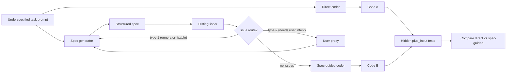

# Adversarial Coevolution for Underspecified Program Synthesis

**Authors:** Amir Sarid; Amit Saroussi; Nitzan Pomerantz; Uri Ariel
**With:** Apart Research
**Event:** The Secure Program Synthesis Hackathon, May 22-24, 2026
**Repository:** https://github.com/aimir/idcs

## Abstract

LLM-generated code routinely passes the obvious examples and silently fails the hidden ones. The usual diagnosis is "the model is weak"; we argue the more useful diagnosis is "the specification is weak". IDCS (Iterative Distinguishing of Code and Specs) studies whether a spec-guided pipeline — generator, distinguisher, user-proxy, coder — can outperform direct code generation on underspecified program-synthesis tasks where the original prompt is shorter than the behavior it implies, and whether the generator and distinguisher *prompts* themselves can be improved by adversarial coevolution. We evaluate on three MBPP+ slices selected for hidden-edge semantics rather than algorithmic difficulty: an original five-task hard slice (low partial direct, 101/531), a held-out hard-test split (higher partial direct, 406/554), and a nine-task fresh-failures slice (788/994). The hand-written spec-guided pipeline lifts hidden-test pass rate from 19.0% to 33.7% on the original hard slice with one rescue and zero regressions; on the held-out hard-test it lifts 406/554 to 533/554 (+127, two rescues, no regressions); on fresh failures it lifts 788/994 to 863/994 (+75, two rescues, no regressions). A diagnostic ceiling prompt that explicitly encodes the five hard-slice hidden semantics reaches 531/531 (five rescues), proving the architecture can exploit correct specs end-to-end. Coevolution from seed prompts produces transferable rescues on training tasks but, on held-out hard-test, the default prompts currently beat the evolved variants — a clean overfitting signal that turns "validation-gated selection" from a hypothetical concern into the next concrete optimizer step. The spec is the bottleneck — and we can now quantify it.

## 1. Introduction

### 1.1 Secure program synthesis and the specification gap

LLMs now generate plausible code from short prompts, which makes it easy to forget how much intent is missing from a short prompt. For secure program synthesis the gap is sharp: a verifier or test suite can only check the property it was given, so if the specification is wrong, more confident code-generation machinery merely produces a more confidently-wrong program. The hackathon framing makes this explicit — proofs are getting cheaper while specifications remain expensive [2], and specifications are rarely discovered as complete artifacts but rather negotiated, refined, and validated against stakeholders [3].

### 1.2 Spec-driven development as an LLM pipeline

We treat the workflow as four cooperating LLM roles: a **generator** that drafts a structured spec from the natural-language task, a **distinguisher** that critiques the spec for gaps, ambiguities, contradictions, over- and under-constraints, and implicit assumptions, a **user-proxy** that answers when an issue is routed to the user, and a **coder** that implements the final spec. The spec is the intermediate artifact, not the final product; benchmark scoring still happens on the generated code, against hidden tests. This lets us ask a quantitative question — does a spec layer raise hidden-test pass rate? — instead of a stylistic one.

### 1.3 Contributions

1. **A runnable spec-guided synthesis pipeline.** Generator, distinguisher, user-proxy, coder, scorer, and per-episode telemetry. Reward decomposes into generator and distinguisher terms with anti-regression and excess-clarification penalties; § 3.4.
2. **Three benchmark slices for underspecified semantics.** An original hard slice (low partial direct, 101/531), a held-out hard-test split (higher partial direct, 406/554), and a fresh-failures slice (788/994), all selected from MBPP+ `plus_input` for hidden-edge semantics, not algorithmic depth.
3. **Adversarial coevolution of generator and distinguisher *prompts*.** Pareto-elite selection across tasks, anchor retention against the hand-written seed, diversity guard, and mutation feedback that exposes per-task hidden-failure examples.
4. **A measured overfit finding.** Evolved prompts that win on training tasks lose to the default prompts on held-out hard-test (425/554 vs 533/554). This is not a setback; it is the signal that motivates validation-gated selection.
5. **A diagnostic ceiling.** A slice-specific prompt that encodes the five hidden semantics reaches 531/531, proving the architecture itself can exploit correct specs end-to-end, so the remaining bottleneck is automatic spec discovery, not implementation.

### 1.4 Why this matters for the hackathon

The Apart secure-program-synthesis tracks cover specification elicitation, specification validation, spec-driven development, and adversarial robustness for proof tools [1]. IDCS sits at the intersection of the first three: it tries to make missing intent visible before code is generated, and to learn the prompts that elicit and critique that intent. The "GAN-shaped" critic loop also connects naturally to adversarial robustness, but in this hackathon prototype the adversary is the spec-time distinguisher, not a code-time attacker.

## 2. Related Work

### 2.1 GANs and adversarial coevolution

The two-network adversarial setup originates with Goodfellow et al. [4]. We adopt the abstraction — a generator and a critic improving against each other — but at the *prompt* level rather than the weight level: both roles are LLM system prompts that we mutate and score, not parameter sets we backprop through. Population-based prompt search has recently been used for general-purpose LLM tooling (AlphaEvolve [5], ShinkaEvolve [6]) and code agents (Saarthi-style critic loops [7]).

### 2.2 Specifications as the bottleneck

Galois argues that "specifications don't exist" — they are constructed through dialogue and refinement, not retrieved as finished artifacts [3]. Forall R&D's hackathon framing makes the same point quantitatively: proofs are cheap, specifications are expensive [2]. Recent specification-elicitation work (e.g. claimcheck-style spec audits [8]) treats spec construction as a first-class learnable step.

### 2.3 LLM code evaluation under hidden tests

EvalPlus and MBPP+ [9, 10] are our scoring substrate. MBPP+ adds many `plus_input` cases per task; we score on `plus_input` because base tests rarely surface hidden-edge failures. Recent work on code-LLM evaluation (BigCodeBench-style hardening [11], LiveCodeBench-style refreshes [12]) reaches a similar conclusion: easy benchmarks saturate quickly and hide the specification gap.

### 2.4 Spec-driven program synthesis

Classical synthesis from formal specs (Sketch [13], Rosette [14]) assumes the spec is given. Recent neural-symbolic work (DreamCoder-style [15], LLM-augmented Dafny [16]) blends learned components with verifiable specs. IDCS targets the upstream gap: where does the spec come from when the user wrote two sentences?

### 2.5 Other resources

Curated hackathon resources we drew from include `for-all-dev/awesome-secure-program-synthesis` [17], the LessWrong "Secure Program Synthesis" sequence [18], and the EvalPlus leaderboard [19] for context on current direct-generation ceilings. GEPA-style prompt evolution [20] inspired the Pareto-elite and anchor-retention design described in § 3.4.

## 3. Methods

### 3.1 Pipeline

IDCS compares two paths on the same task. The **direct path** sends the task prompt to a coder model and scores the generated function. The **spec-guided path** asks the generator to produce a structured spec, the distinguisher to critique it (each issue tagged with route ∈ {generator, user}), and after a bounded number of turns the coder produces code from prompt + final spec.



**Figure 1.** Pipeline structure. Issues that the generator should fix without bothering the user (type-1) loop internally; issues needing intent (type-2) escalate to the user-proxy.

### 3.2 Benchmark slices

Seed corpora saturated quickly: both paths solved nearly everything. We therefore curated three MBPP+ slices selected for **hidden-edge semantics**, not algorithmic difficulty.

| Slice | Tasks | Total hidden tests | Direct pass rate (default coder) | Purpose |
| --- | --- | ---: | ---: | --- |
| `hard` / `hard-train` | `Mbpp/{639, 597, 427, 92, 459}` | 531 | 101/531 = 19.0% | Original low-direct slice; 5/5 direct task failures. |
| `hard-test` | `Mbpp/{785, 451, 757, 576, 765}` | 554 | 406/554 = 73.3% | Held-out split; strict-hard (5/5 direct task failures) with higher partial direct. |
| `fresh-failures` | 9 base-OK / plus-fail tasks from an `mbpp-plus` sample-60 probe | 994 | 788/994 = 79.3% | Broader sanity check over freshly observed failures. |

Hard-slice picks share a pattern: the natural-language prompt is short, the hidden EvalPlus tests probe a specific edge (punctuation in `remove_uppercase`, empty halves in `find_kth`, exact casing in `sample_nam`, 1-indexed undulation in `is_undulating`, etc.). These are the cases where the spec layer has something useful to contribute.

### 3.3 Scoring

For MBPP+ tasks, each candidate is executed against `plus_input` cases. We run user code in a **subprocess** harness, not in-process — EvalPlus's `reliability_guard` calls `setrlimit(RLIMIT_AS, …)` which macOS does not honor for non-root processes, killing the worker before it produces results. Subprocess isolation is weaker than EvalPlus's grader but crash-safe and platform-portable; the comparison logic against `get_groundtruth` is otherwise identical.

We report direct pass rate, spec-guided pass rate, strict task-level rescues (direct failed → spec passed), strict regressions, aggregate hidden-test pass count, and benchmark delta vs direct baseline.

### 3.4 Reward shape

Per-trace reward decomposes into per-role terms with the following structure (`src/idcs/rewards.py`):

```
R_G = α·benchmark
    − β·type1_count
    − γ·spec_complexity_penalty
    − ρ·regression_penalty

R_D = α·benchmark
    + β·type1_fixed_count
    + δ·useful_clarification_rate
    − ε·type2_dismissed_count
    − cap·excess_type2_above_cap
    − ρ·regression_penalty
```

`regression_penalty = max(0, baseline_score − benchmark_score)` is applied to both roles when a no-spec baseline is available; it stops coevolution from trading one rescued task for broad partial regressions elsewhere (a real failure mode we observed; § 4.5). `excess_type2_penalty` caps the cost of asking the user — penalize on the cap, not the average. `type1_fixed_count` uses `(kind, location)` as the issue identity so D cannot earn credit by rewording a stale issue.

### 3.5 Coevolution

Coevolution is GEPA-shaped [20] but lightweight: each epoch we evaluate a population of generator and distinguisher prompts on sampled tasks, score them under the reward above, and keep an elite by **task-level Pareto** (`--elite-selection pareto`) so prompts that win on different tasks survive. Anchor retention keeps the original hand-written seed in the population (`keep_anchor=true` by default) to bound forgetting. A diversity guard (`SequenceMatcher ≥ 0.92`) rejects near-duplicate mutations. Mutation feedback now includes per-task hidden-failure examples and peer-elite summaries so the mutator can act on the actual failure semantics, not just aggregate reward.

## 4. Results

### 4.1 Hand-written pipeline on the original hard slice

The hand-written spec-guided pipeline (default generator/distinguisher/coder, Codex `gpt-5.4-mini`) against direct generation on the original 5-task hard slice:

| Task | Function | Direct plus pass | Spec-guided plus pass | Result |
| --- | --- | ---: | ---: | --- |
| `Mbpp/427` | `change_date_format` | 12/112 | 12/112 | no change |
| `Mbpp/639` | `sample_nam` | 2/111 | 2/111 | no change |
| `Mbpp/459` | `remove_uppercase` | 25/103 | 25/103 | no change |
| `Mbpp/92`  | `is_undulating` | 32/101 | **101/101** | rescued |
| `Mbpp/597` | `find_kth` | 39/104 | 39/104 | no change |
| **Total** | 5 tasks | **110/531 = 20.7%** | **179/531 = 33.7%** | **1 rescue, 0 regressions** |

The benchmark is not saturated, and the spec-guided path has measurable headroom on hidden-edge tasks.

### 4.2 Gold-spec hardened POC

To separate "do specs matter?" from "does our generated-spec loop already produce good enough specs?", we ran a small hardened POC where each task ships with a **gold** spec. With the gold spec, the same coder solves 4/5 tasks that direct generation misses; with the generated spec, it still solves 0/5. That bounds the headroom: specifications matter for these tasks, and our current generated-spec loop is not yet recovering them.

### 4.3 Held-out hard-test split (new)

The PR #14 update introduced a held-out split (`Mbpp/{785, 451, 757, 576, 765}`, 554 total tests). Direct still fails all five tasks strictly (5/5 direct task failures), but partial direct pass count is much higher than the original hard slice — these are "almost right" tasks where most hidden tests pass but the edge cases fail.

| Run | Prompts | Direct | Spec-guided | Δ | Rescued | Regressed |
| --- | --- | ---: | ---: | ---: | ---: | ---: |
| `hard-test-default-compare-gpt55` | default G/D, `gpt-5.5` | 406/554 | **533/554** | **+127** | 2/5 | 0/5 |
| `hard-test-pareto-rich-epoch1-seed2026052502-gpt55` | unanchored evolved epoch-1 G/D | 406/554 | 419/554 | +13 | 1/5 | 0/5 |
| `hard-test-clean-anchored-g1d1-gpt55` | anchored + quiet-D evolved G/D | 412/554 | 425/554 | +13 | 0/5 | 0/5 |
| `hard-test-default-gd-semantic-coder-gpt55` | default G/D + semantic coder prompt | 431/554 | 412/554 | -19 | 1/5 | 1/5 |

The hand-written default prompts win by a large margin (+127 vs +13). The evolved prompts still improve over direct, but they were selected on training reward and they generalize worse than the seed.

### 4.4 Fresh-failures broader slice (new)

To check this is not specific to one held-out tuple, we ran the default pipeline over nine freshly-observed direct failures from a separate MBPP+ sample-60 probe:

| Run | Prompts | Direct | Spec-guided | Δ | Rescued | Regressed |
| --- | --- | ---: | ---: | ---: | ---: | ---: |
| `fresh-failures-default-gpt55` | default G/D, `gpt-5.5` | 788/994 | **863/994** | **+75** | 2/9 | 0/9 |
| `fresh-failures-semantic-v1-gpt55` | semantic G/D/coder prompts | 824/994 | 857/994 | +33 | 1/9 | 0/9 |

Same pattern: the default spec layer adds real lift on broader fresh failures (+75 over direct, no regressions), and the semantic-prompt variants underperform.

### 4.5 Coevolution: signal, transfer, and overfit

A 5-epoch local coevolution run on the original hard slice (population 4, elite 2, max_turns 2, task_sample 3, `gpt-5.4-mini`, 587 LLM calls; `experiments/runs/20260524T185513Z`) produced a training arc:

| Epoch | Best R_G | Avg R_G | Best R_D | Avg R_D |
| ---: | ---: | ---: | ---: | ---: |
| 1 | 0.179 | 0.113 | 0.283 | 0.218 |
| 2 | 0.242 | 0.112 | 0.312 | 0.245 |
| 3 | 0.254 | 0.091 | 0.311 | 0.291 |
| 4 | 0.127 | 0.100 | 0.515 | 0.367 |
| 5 | 0.342 | 0.143 | 0.442 | 0.376 |

Validating **observed co-occurring** pairs on the full hard slice (not best-G × best-D mixes):

| Pair | Direct | Spec-guided | Strict | Notes |
| --- | ---: | ---: | --- | --- |
| `a56ca6ec5efd` + `86ea640db580` | 101/531 | 179/531 | 1 rescue, 0 regressed | Same lift family as hand-written seed. |
| `a56ca6ec5efd` + `98ca99b555db` | 101/531 | 179/531 | 1 rescue, 0 regressed | Replication. |
| Worst observed pair | 110/531 | 101/531 | 0 rescue, 0 regressed | Partial regression on `Mbpp/597` motivated the anti-regression term in § 3.4. |

**The overfit finding.** On `hard-test`, default prompts win (+127); the evolved variants get +13. On `hard-dev`, the unanchored evolved epoch-1 pair gets +75 (363/440 → 438/440, 2/4 rescues), but the default lift on the same tasks is similar. Together with the §4.3 table, this says clearly: training reward is selecting prompts that generalize worse than the hand-written seed. This is the standard symptom of small-sample optimization on a noisy reward; it is also exactly the signal that motivates the next research step (§5).

### 4.6 Diagnostic ceiling

A deliberately slice-specific prompt pair (`prompts/hard_mbpp_rules_generator_v0.md`, `prompts/hard_mbpp_rules_distinguisher_v0.md`) that encodes the five hard-slice hidden semantics reaches 531/531:

| Task | Direct | Spec-guided |
| --- | ---: | ---: |
| `Mbpp/639` `sample_nam` | 2/111 | 111/111 |
| `Mbpp/597` `find_kth` | 39/104 | 104/104 |
| `Mbpp/427` `change_date_format` | 3/112 | 112/112 |
| `Mbpp/92`  `is_undulating` | 32/101 | 101/101 |
| `Mbpp/459` `remove_uppercase` | 25/103 | 103/103 |
| **Total** | **101/531 = 19.0%** | **531/531 = 100%** |

This is a *ceiling proof*, not a generalization claim. It demonstrates that the pipeline architecture — generator → distinguisher → user-proxy → coder, scored on hidden tests — can convert correct spec content into correct code end-to-end on this slice. The unsolved research problem is automatic discovery of those semantics.

### 4.7 Summary across slices

| Slice | Direct | Best spec | Δ | Best evolved Δ | Default beats evolved? |
| --- | ---: | ---: | ---: | ---: | --- |
| `hard` (5 tasks, 531 tests) | 101/531 | 531/531 (ceiling) / 179/531 (general) | +430 / +78 | +78 | — (ceiling is slice-specific) |
| `hard-test` (5 tasks, 554 tests) | 406/554 | 533/554 (default) | +127 | +13 | **yes** |
| `fresh-failures` (9 tasks, 994 tests) | 788/994 | 863/994 (default) | +75 | — | n/a (no evolved baseline here) |

## 5. Discussion

### 5.1 The honest result

A spec layer demonstrably helps on hidden-edge tasks (+127 on hard-test, +75 on fresh failures, +78 from evolved prompts on hard, +430 from a ceiling prompt on hard). The architecture is not the bottleneck. What we have not yet shown is that *learning* the right specifications — by coevolving the prompts — beats hand-written seed prompts on held-out tasks. Right now it does not.

### 5.2 Why the evolved prompts overfit

Three plausible causes, in order of how easy they are to test:

1. **Small task samples per candidate.** Three sampled tasks per evaluation cannot disambiguate a generally-useful mutation from one that happens to score on the sampled three. The reward is too high-variance for the population size.
2. **Reward shape rewards critique volume.** R_D credits `type1_fixed_count` and `useful_clarification_rate`. A noisier distinguisher that flags more issues can win on training reward without improving — or even while hurting — final-code hidden-test pass rate.
3. **No held-out gate.** Selection currently uses the same tasks the candidates were evaluated on. There is no validation gate that requires "beats the anchor on held-out tasks before promotion".

### 5.3 Future work

The immediate next step is **validation-gated selection**: a mutation is only promoted into the elite if it beats the anchor on a held-out task pool. Anchor retention (§3.5) is a partial mitigation; a validation gate makes the held-out comparison structural.

After that: (a) expand each hard slice from 5 to ~30 tasks, still selected for underspecified semantics, to reduce sampled-reward variance; (b) revisit reward weights so quieter D wins ties with noisier D when benchmark outcome is equal (partially done in PR #14 tie-break); (c) move toward security-shaped tasks (access control, input validation, path traversal, redaction policy) where the missing intent has concrete safety consequences; (d) make the coder a separate optimizable prompt rather than a fixed default; (e) port the optimizer to a properly-released GEPA backend [20] to avoid hand-rolling Pareto/anchor logic.

### 5.4 Limitations

Three claims worth being careful about. First, the original hard slice has only 5 tasks; the held-out hard-test split has 5; the fresh-failures slice has 9. None of these is enough for a strict statistical claim — they are enough to surface qualitative effects. Second, the user-proxy is a simplification of an actual human stakeholder; a real human answers inconsistently and reveals constraints late. Third, the ceiling prompt is intentionally slice-specific and should never be cited as a general result.

## 6. Conclusion

We built a runnable spec-guided program-synthesis pipeline, three hidden-edge MBPP+ slices, an adversarial coevolution loop with Pareto-elite selection and anchor retention, and an anti-regression reward term. On every slice we tested, a spec layer beats direct generation on hidden-test pass rate. The architecture also admits a clean ceiling: a slice-specific prompt reaches 531/531 on the original hard slice, proving the limit is spec content, not pipeline plumbing.

The honest negative result is the most useful one for the secure-program-synthesis community: small-sample, single-pool reward optimization can select prompts that beat training tasks but lose to the hand-written seed on held-out tasks. That is the failure mode the next iteration is designed to remove (validation-gated selection, larger task pools, quieter-critic tie-breaks). The takeaway is therefore not "we solved it" but a much more useful one for spec-driven development: **the spec is the bottleneck — and we can now quantify it**.

## Code and Data

- **Repository:** https://github.com/aimir/idcs
- **PR stack:** PR #10 (Phase 3 coevolution base); PR #11 (Codex backend + batch runner); PR #12 (hard MBPP+ slice); PR #13 (hardened gold-spec POC); PR #14 (coevolution observability, hard-test/hard-dev/fresh-failures splits, Pareto elite + anchor + anti-regression).
- **Datasets:** MBPP+ via EvalPlus (`hard`/`hard-train`/`hard-dev`/`hard-test`/`hard-extended` splits + `fresh-failures` task list).
- **Headline artifacts:**
  - Original hard-slice default-pipeline run: `experiments/runs/20260524T185513Z/`.
  - Diagnostic ceiling: `experiments/runs/hard-rules-v0-repo-mt2-20260525T003333Z/`.
  - Held-out hard-test default: `experiments/runs/hard-test-default-compare-gpt55-20260525T0235Z/`.
  - Held-out hard-test evolved (best): `experiments/runs/hard-test-pareto-rich-epoch1-seed2026052502-gpt55-20260525T0230Z/`.
  - Fresh-failures default: `experiments/runs/fresh-failures-default-gpt55-20260525T045910/`.
- **Diagnostic ceiling prompts:** `prompts/hard_mbpp_rules_generator_v0.md`, `prompts/hard_mbpp_rules_distinguisher_v0.md`.

## Author Contributions

Authors listed alphabetically by first name. Amir Sarid initiated the project, designed the four-role spec-guided architecture and the coevolution reward shape, and led Phase 3 experiments and overall direction. Amit Saroussi led benchmark integration, the hard / hard-test / hard-dev / fresh-failures splits, the Pareto elite + anchor retention + anti-regression optimizer changes, and the PR #14 evidence ledger. Nitzan Pomerantz contributed issue framing, review feedback, and benchmark-debugging guidance. Uri Ariel contributed issue taxonomy and vulnerability-benchmark scoping. All authors contributed to experiment design, interpretation, and writing.

## References

1. Apart Research. 2026. *The Secure Program Synthesis Hackathon.* https://apartresearch.com/sprints/secure-program-synthesis-hackathon-2026-05-22-to-2026-05-24
2. Dougherty, Q. / Forall R&D. 2026. *Tractable Problems in AI Security via Formal Methods.* https://tractable.for-all.dev/apart-hackathon.pdf
3. Galois. *Specifications Don't Exist.* https://www.galois.com/articles/specifications-dont-exist
4. Goodfellow, I. et al. 2014. *Generative Adversarial Networks.* arXiv:1406.2661.
5. AlphaEvolve / Google DeepMind. 2024-25. Population-based prompt and code evolution writeups.
6. ShinkaEvolve. 2025. Open-source prompt-evolution toolkit.
7. Saarthi. 2025. Critic-loop code agent.
8. claimcheck-style specification audit tooling.
9. Liu, J. et al. *EvalPlus: Rigorous Evaluation of LLM-Synthesized Code.* https://github.com/evalplus/evalplus
10. MBPP+ (extension of MBPP with `plus_input` cases). https://evalplus.github.io/
11. BigCodeBench.
12. LiveCodeBench (continuous-refresh code eval).
13. Solar-Lezama, A. *Sketch synthesis system.*
14. Bornholt, J. & Torlak, E. *Rosette symbolic virtual machine.*
15. Ellis, K. et al. *DreamCoder.*
16. LLM-augmented Dafny / verified-code generation surveys.
17. for-all-dev. *awesome-secure-program-synthesis.* https://github.com/for-all-dev/awesome-secure-program-synthesis
18. LessWrong. *Secure Program Synthesis sequence.* https://www.lesswrong.com/s/uuY62aBQw8j3ASaCS
19. EvalPlus leaderboard. https://evalplus.github.io/
20. GEPA (prompt-pair coevolution; Pareto-elite inspiration).
21. Kiniry, J. 2026. *Secure program synthesis hackathon slides.*
22. LessWrong. *Spec-driven development discussions.*
23. Various: hackathon resource set at https://www.lesswrong.com/s/uuY62aBQw8j3ASaCS.

## Appendix

### A. Slice composition

- **`hard` / `hard-train`** — `Mbpp/427` (`change_date_format`), `Mbpp/639` (`sample_nam`), `Mbpp/459` (`remove_uppercase`), `Mbpp/92` (`is_undulating`), `Mbpp/597` (`find_kth`). 531 hidden tests. Direct fails 5/5 strictly; partial direct 101/531.
- **`hard-test`** — `Mbpp/785`, `Mbpp/451`, `Mbpp/757`, `Mbpp/576`, `Mbpp/765`. 554 hidden tests. Direct fails 5/5 strictly; partial direct 406/554.
- **`hard-dev`** — held-out subset for dev split, 4 tasks / 440 hidden tests; partial direct 363/440.
- **`fresh-failures`** — nine base-OK / plus-fail tasks sampled from an `mbpp-plus` sample-60 probe; 994 hidden tests; partial direct 788/994.

### B. Repro commands

Default spec-guided pipeline on the original hard slice:

```bash
IDCS_BACKEND=codex \
IDCS_CODEX_MODEL=gpt-5.4-mini \
IDCS_CODEX_TIMEOUT_S=180 \
uv run --no-project --with '.[dev]' python scripts/batch_baseline.py \
  --dataset hard \
  --workers 2 \
  --retries 0 \
  --max-turns 3
```

Diagnostic hard-slice ceiling run:

```bash
IDCS_BACKEND=codex \
IDCS_CODEX_MODEL=gpt-5.4-mini \
IDCS_CODEX_SERVICE_TIER=fast \
IDCS_CODEX_REASONING_EFFORT=none \
IDCS_CODEX_TIMEOUT_S=300 \
uv run --no-project --with '.[dev]' python scripts/batch_baseline.py \
  --dataset hard \
  --workers 5 \
  --retries 0 \
  --max-turns 2 \
  --generator-prompt-file prompts/hard_mbpp_rules_generator_v0.md \
  --distinguisher-prompt-file prompts/hard_mbpp_rules_distinguisher_v0.md
```

Coevolution run from seed prompts:

```bash
IDCS_BACKEND=codex \
IDCS_CODEX_MODEL=gpt-5.4-mini \
IDCS_CODEX_SERVICE_TIER=fast \
IDCS_CODEX_REASONING_EFFORT=none \
IDCS_CODEX_TIMEOUT_S=300 \
uv run --no-project --with '.[dev]' python scripts/train.py \
  --benchmark hard \
  --epochs 5 \
  --pop-size 4 \
  --elite-size 2 \
  --max-turns 2 \
  --task-sample 3 \
  --seed 2026052402 \
  --max-llm-calls 650
```

Held-out hard-test evaluation of a saved prompt pair:

```bash
IDCS_BACKEND=codex \
IDCS_CODEX_MODEL=gpt-5.5 \
IDCS_CODEX_SERVICE_TIER=fast \
IDCS_CODEX_REASONING_EFFORT=none \
IDCS_CODEX_TIMEOUT_S=300 \
uv run --no-project --with '.[dev]' python scripts/batch_baseline.py \
  --dataset hard-test \
  --workers 2 \
  --retries 0 \
  --max-turns 2 \
  --generator-prompt-file <path-to-G.md> \
  --distinguisher-prompt-file <path-to-D.md>
```

### C. What would count as stronger evidence?

1. ≥30 tasks per slice with consistent direct-failure structure.
2. A held-out validation pool used by the optimizer as a hard promotion gate.
3. Evolved prompts that beat default prompts on held-out hard-test (currently 533/554 is the default baseline to beat).
4. Generated-spec rescues on the hardened gold-spec POC (currently 0/5).
5. Examples where the distinguisher's flagged issue is the literal hidden-test edge case (i.e., the spec layer is mechanistically right, not just statistically right).

### D. LLM Usage Statement

LLM assistance was used to draft report text, inspect code and run artifacts, generate and mutate prompts, and run code-generation experiments. All numeric claims here were checked against local run artifacts listed in the "Code and Data" section.
